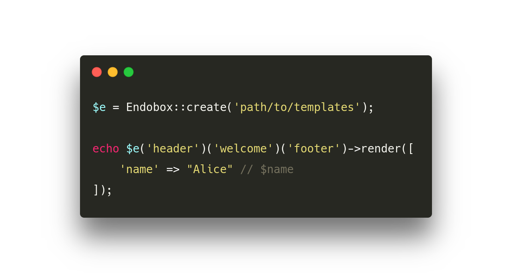

# ENDOBOX

__clean af template engine.__

[](https://travis-ci.org/younishd/endobox)
[](https://codeclimate.com/github/younishd/endobox)
[](https://packagist.org/packages/younishd/endobox)
[](https://packagist.org/packages/younishd/endobox)
[](https://packagist.org/packages/younishd/endobox)



| :seedling: Native PHP syntax | :pencil: Markdown on-board | :rocket: Efficient API |
| :---: | :---: | :---: |
| Write templates in vanilla PHP. No need to learn a new syntax. | A full-blown Markdown parser is built right in. Yes, it can be combined with PHP! | Do powerful things with just a handful of elementary methods. |

---

## Documentation

### Installation

The recommended way to install ENDOBOX is via [Composer](https://getcomposer.org):

```bash
composer require younishd/endobox
```

You will need at least __PHP 7.0.0__.

### Get started

The typical way to configure ENDOBOX to load templates for an application looks like this:

```php
require_once '/path/to/vendor/autoload.php';

$endobox = \endobox\Endobox::create('path/to/templates');

$endobox->addFolder('another/path/to/templates'); // optional
```

### Render templates

The first thing you want to do is instantiate a template `Box` as follows:

```php
$welcome = $endobox('welcome');
```

To render the template with some variables call the `render()` method:

```php
echo $welcome->render([ 'name' => "Alice" ]);
```

The template file itself could look like this:

###### `welcome.php`

```
<h1>Hello, <?= $name ?>!</h1>
```

### File extensions

ENDOBOX decides how to render a template based on the __file extension__.

When you instantiate the template `Box` however, the extension is omitted.

```php
$members = $endobox('members'); // no file extension
```

#### PHP: `.php`

PHP templates are processed by evaluating the code between PHP tags (i.e., `<? … ?>`) and returning the result.


###### `members.php`

```
<h1>Members</h1>
<ul>
    <?php foreach ($users as $u): ?>
        <li><?= $u->name ?></li>
    <?php endforeach ?>
</ul>
```

> :information_source: __Protip:__ The `<?=` is syntactic sugar for `<?php echo`.

#### Markdown: `.md`

Markdown templates are processed by a Markdown parser ([Parsedown](https://github.com/erusev/parsedown)) which produces the corresponding HTML code. This can be used for static content.

###### `members.md`

```markdown
# Members

- Alice
- Bob
- Carol
```

#### PHP+Markdown: `.md.php`

As the name suggests, this template type combines both PHP and Markdown: The template gets evaluated as PHP first, then parsed as Markdown. Pretty neat.

###### `members.md.php`

```
# Members

<?php foreach ($users as $u): ?>
    - <?= $u->name ?>
<?php endforeach ?>
```

#### HTML: `.html`

HTML templates are always printed as is. No further processing takes place.

###### `members.html`

```html
<h1>Members</h1>
<ul>
    <li>Alice</li>
    <li>Bob</li>
    <li>Carol</li>
</ul>
```

### Data

Data is accessible inside a template as simple __variables__ (e.g., `$foo`) where the variable name corresponds to the assigned array key or property.

```
<h1>Hello, <?= $username ?>!</h1>
```

#### Assign data

There are several ways to assign data to a template box:

```php
// via assign(…)
$welcome->assign([ "username" => "eve" ]);

// via object property
$welcome->username = "eve";

// via render(…)
$welcome->render([ "username" => "eve" ]);
```

Notice that `assign()` and `render()` both receive an `array` as argument.

#### Shared data

Usually, template boxes are isolated from each other. Data that's been assigned to one box, will not be visible from another.

```php
$welcome->username = "eve";          // not accessible to 'profile'
$profile->email = "eve@example.com"; // not accessible to 'welcome'
```

If they should share their data however, you can __link__ them together:

```php
$welcome->link($profile);
```

Now, these template boxes are linked and they share the same data.

###### `welcome.php`

```php
<h1>Hello, <?= $username ?>!</h1>
<p>Your email address is: <code><?= $email ?></code></p>
```

###### `profile.php`

```php
<h1>Profile</h1>
<ul>
    <li>Username: <strong><?= $username ?></strong></li>
    <li>Email: <strong><?= $email ?></strong></li>
</ul>
```

Notice how `welcome.php` prints out `$email` which was initially assigned to `$profile` and `profile.php` echoes `$username` even though it was assigned to `$welcome`.

#### Escaping

Escaping is a form of data filtering which sanitizes unsafe, user supplied input prior to outputting it as HTML.

ENDOBOX provides two shortcuts to the `htmlspecialchars()` function: `$escape()` and its shorthand version `$e()`

```php
<h1>Hello, <?= $escape($username) ?>!</h1>

<h1>Hello, <?= $e($username) ?>!</h1>
```

##### Escaping HTML attributes

> :warning: __Warning:__ It's VERY important to always double quote HTML attributes that contain escaped variables, otherwise your template will still be open to injection attacks (e.g., [XSS](https://www.owasp.org/index.php/Cross-site_Scripting_(XSS))).

```php
<!-- Good -->
">

<!-- BAD -->
'>

<!-- BAD -->
>
```

### Chaining & Nesting

Since you're rarely dealing with just a single template you might be looking for a method that combines multiple templates in a meaningful way.

By __chaining__ we mean concatenating templates without rendering them.

Chaining two templates is as simple as:

```php
$header($article);
```

Now, calling `->render()` on either `$header` or `$article` will render both templates and return the concatenated result.

The benefit of not having to render the templates to strings right away is _flexibility_: You can define the layout made out of your templates before knowing the concrete values of their variables.

The general syntax for chaining a bunch of templates is simply:

```php
$first($second)($third)($fourth); // and so on
```

Neat.

A different approach (probably the _template designer_ rather than the _developer_ way) would be to define some sort of __layout template__ instead:

###### `layout.php`

```
<html>
<head></head>
<body>
<header><?= $header ?></header>
<article><?= $article ?></article>
<footer><?= $footer ?></footer>
```

Then somewhere in controller land:

```php
$layout = $endobox('layout');
$header = $endobox('header');   // header.html
$article = $endobox('article'); // article.php
$footer = $endobox('footer');   // footer.html

echo $layout->render([
    'header' => $header,
    'article' => $article->assign([ 'title' => "How to make Lasagna" ]),
    'footer' => $footer
]);
```

This should be fine, but we can get rid of some boilerplate code here: `$header` and `$footer` really don't need to be variables.

That's where __nesting__ comes into play!

Use the `$box()` function to instantiate a template `Box` from _inside_ another template:

###### `layout.php`

```
<html>
<head></head>
<body>
<header><?= $box('header') ?></header>
<article><?= $article ?></article>
<footer><?= $box('footer') ?></footer>
```

Then simply…

```php
echo $endobox('layout')->render([
    'article' => $endobox('article')->assign([ 'title' => "How to make Lasagna" ])
]);
```

This is already much cleaner, but it gets even better: Since we have used `$box()` to nest a template `Box` inside another these two boxes are __linked__ by default!

Check it out:

###### `layout.php`

```
<html>
<head></head>
<body>
<header><?= $box('header') ?></header>
<article><?= $box('article') ?></article>
<footer><?= $box('footer') ?></footer>
```

Then one line…

```php
echo $endobox('layout')->render([ 'title' => "How to make Lasagna" ]);
```

Just clean af.

## License

_ENDOBOX_ is open-sourced software licensed under the [MIT license](LICENSE).
